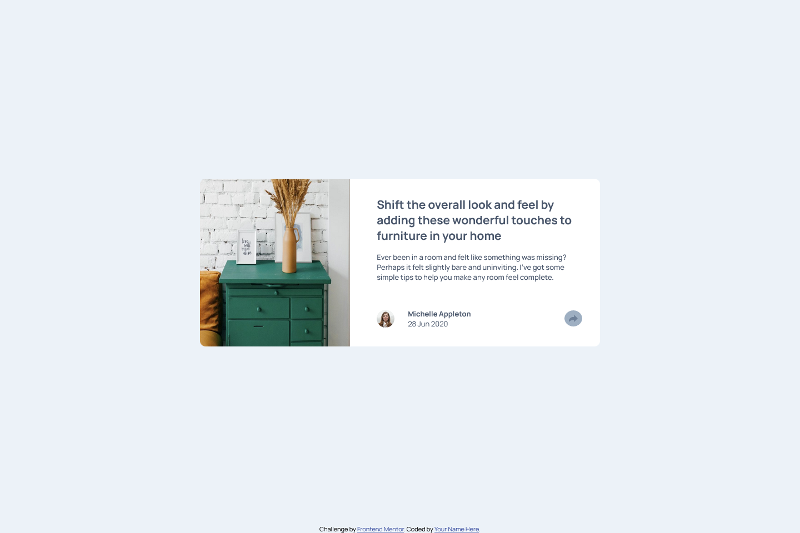

# Frontend Mentor - Article preview component solution

This is a solution to the [Article preview component challenge on Frontend Mentor](https://www.frontendmentor.io/challenges/article-preview-component-dYBN_pYFT). Frontend Mentor challenges help you improve your coding skills by building realistic projects. 

## Table of contents

- [Overview](#overview)
  - [Screenshot](#screenshot)
  - [Links](#links)
- [My process](#my-process)
  - [Built with](#built-with) 
  - [Continued development](#continued-development) 
- [Author](#author)
- [Acknowledgments](#acknowledgments)

**Note: Delete this note and update the table of contents based on what sections you keep.**

## Overview

### Screenshot

### Links

- Live Site URL: [https://tchananet.github.io/frontendmentor/article-preview-component-master](https://tchananet.github.io/frontendmentor/article-preview-component-master)

## My process

### Built with

- Semantic HTML5 markup
- CSS custom properties
- CSS Flex
- Pure Javascript

### Continued development

Need to learn how to make the share footer stand over in the desktop mode

## Author

<!-- - Website - [Add your name here](https://www.your-site.com) -->

- Frontend Mentor - [@tchananet](https://www.frontendmentor.io/profile/tchananet)
<!-- - Twitter - [@yourusername](https://www.twitter.com/yourusername) -->
