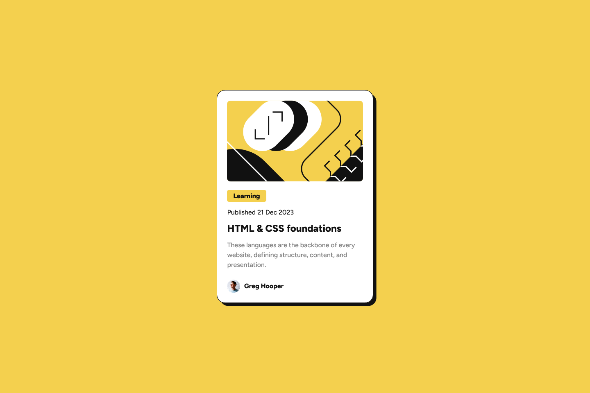

# Frontend Mentor - Blog preview card solution

This is a solution to the [Blog preview card challenge on Frontend Mentor](https://www.frontendmentor.io/challenges/blog-preview-card-ckPaj01IcS). Frontend Mentor challenges help you improve your coding skills by building realistic projects. 

## Table of contents

- [Overview](#overview)
  - [Screenshot](#screenshot)
  - [Links](#links)
- [My process](#my-process)
  - [Built with](#built-with)
  - [What I learned](#what-i-learned)
  - [Continued development](#continued-development)
  - [Useful resources](#useful-resources)
- [Author](#author)
- [Acknowledgments](#acknowledgments)

**Note: Delete this note and update the table of contents based on what sections you keep.**

## Overview

### Screenshot

### Links

- Live Site URL: [https://tchananet.github.io/frontendmentor/social-links-profile-main](https://tchananet.github.io/frontendmentor/social-links-profile-main)

## My process

### Built with

- Semantic HTML5 markup
- CSS custom properties
- CSS Flex

### What I learned

Learned more about clamp() and element aligment

### Continued development

I had some matching the design as close as possible, espcially with size, padding and margin.
I had to put the design next to the rendered website and try to match by observing the differences.

### Useful resources

- [MDN](https://developer.mozilla.org/en-US/docs/Web/CSS) - This helped me learn and discover some nice CSS tricks like @media and list-style

## Author

<!-- - Website - [Add your name here](https://www.your-site.com) -->

- Frontend Mentor - [@tchananet](https://www.frontendmentor.io/profile/tchananet)
<!-- - Twitter - [@yourusername](https://www.twitter.com/yourusername) -->
